# Train and Deploy Model with AutoAI

This tutorial guides you through the complete process of training a machine learning model using IBM watsonx.ai AutoAI, deploying it to a deployment space, and then calling the deployed model from a Jupyter notebook.

## What You'll Learn

- How to access and navigate watsonx.ai
- How to train a machine learning model using AutoAI (automated machine learning)
- How to deploy your trained model to a deployment space
- How to call your deployed model via API from a Jupyter notebook

## Prerequisites

### 1. Get Your IBM Cloud API Key

Before starting, you need to obtain an API key from IBM Cloud. This key will be used to authenticate your requests to the deployed model.

**Steps to get your API key:**
1. Log in to [IBM Cloud](https://cloud.ibm.com)
2. Navigate to **Manage** → **Access (IAM)** in the top menu
3. Click on **API keys** in the left sidebar
4. Click **Create** button to generate a new API key
5. Give your API key a descriptive name (e.g., "watsonx-autoai-key")
6. Click **Create**
7. **Important:** Copy and save the API key immediately - you won't be able to see it again!
8. Store it securely - you'll need it later in the notebook

---

## Part 1: Access watsonx.ai Project

### Step 1: Navigate to watsonx.ai Platform

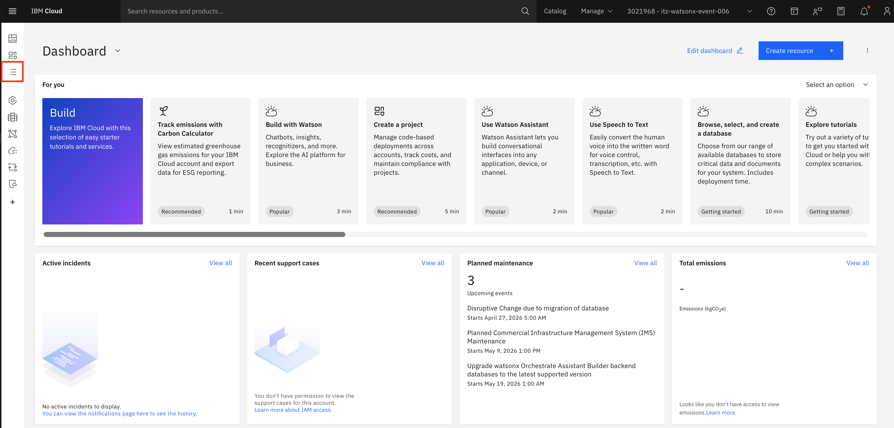

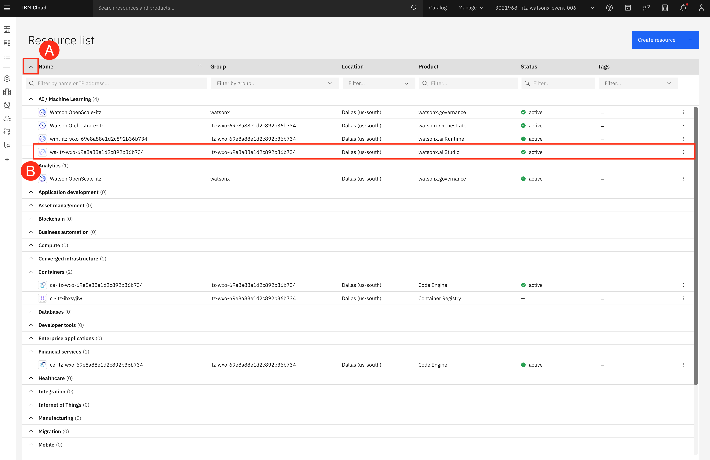

Log in to IBM Cloud and navigate to the watsonx.ai platform. From the IBM Cloud dashboard, locate and click on your watsonx.ai Studio service instance.

### Step 2: Open watsonx.ai Studio in IBM watsonx
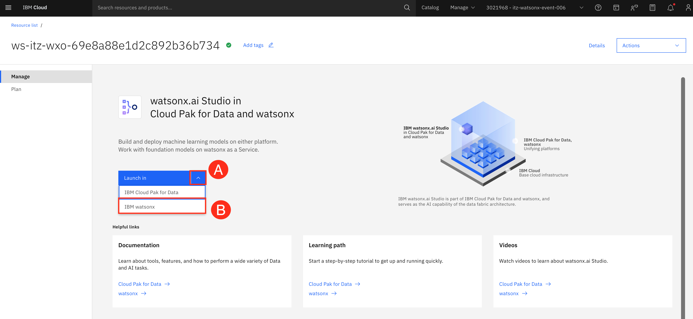

IBM watsonx will open in a new browser tab. If you are not automatically redirected, click on the watsonx.ai logo in the top left corner to return to the platform.

Once in watsonx.ai, you'll see the main interface. Click on **Projects** in the left navigation menu to view all your available projects.

### Step 3: Select Your Project

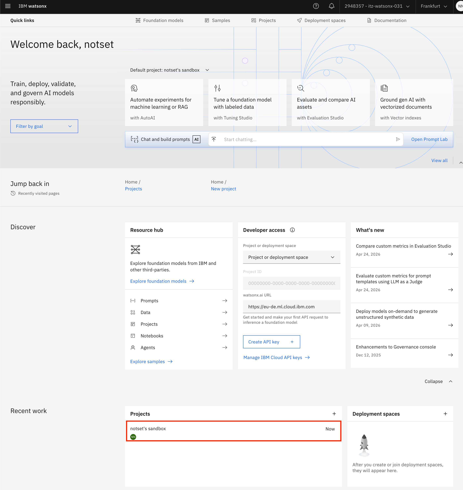

From the projects list, locate and click on your project called `notset's sandbox`. This will open your project workspace.

### Step 4: Project Overview

You're now in your project workspace. Here you can see:
- **Assets**: Your datasets, notebooks, models, and other resources
- **Tools**: Available tools including AutoAI, Jupyter notebooks, and more
- **Collaborators**: Team members with access to this project

---

## Part 2: Import Dataset and Train Model Using AutoAI

Before training a model with AutoAI, you need to import your training dataset into the watsonx.ai project. AutoAI is an automated machine learning tool that automatically prepares data, applies algorithms, and builds model pipelines. It tests multiple algorithms and configurations to find the best model for your data.

### Step 1: Add Dataset to Project

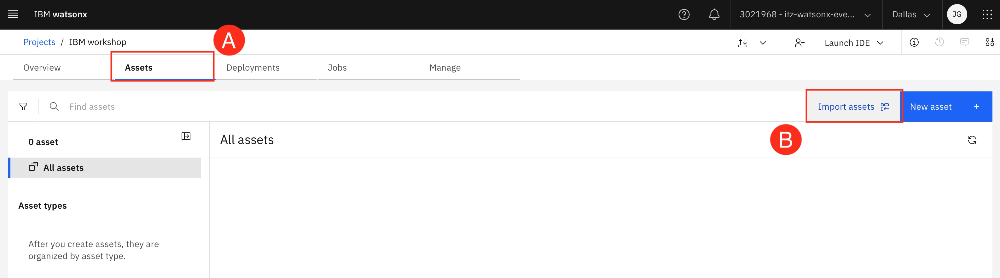

First, you need to import your training data into the project:
1. From your project workspace, click on the **Assets** tab
2. Click **Import assets** button
3. Select **Local file -> Data** from the asset types
4. This will open the data import interface

**Why import data first?**
Your dataset needs to be stored in the project before AutoAI can use it for training. This also makes the data available for other tools like notebooks and visualizations.

### Step 2: Upload Training Dataset

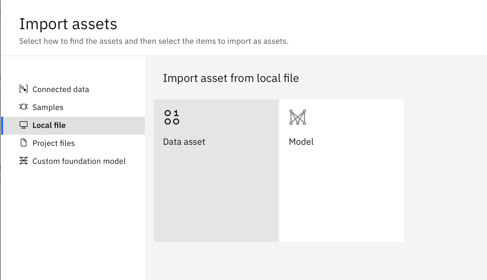

Now upload your CSV file:
1. Click **Browse** or drag and drop your file into the upload area
2. Select your training and testing datasets file (`HousingData_train.csv` and `HousingData_test.csv` from the [AutoAI/data/](https://github.com/garcejan/IFSA-students/tree/main/AutoAI/data) folder)
3. Wait for the upload to complete - you'll see a progress indicator
4. Once uploaded, the dataset will appear in your project's **Data assets** section

**Dataset Requirements:**
- File format: CSV (Comma-Separated Values)
- File size: Should be under the project's storage limit
- Data quality: Clean data with appropriate column headers

### Step 3: Verify Dataset Import

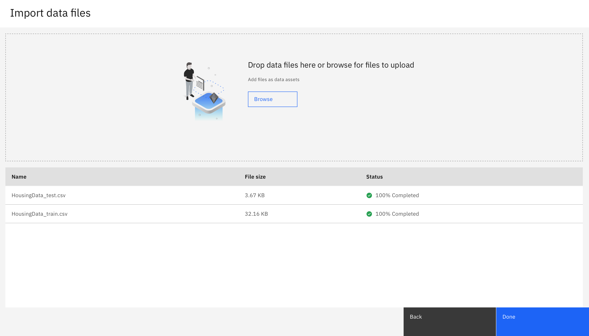

After uploading, verify your dataset:
1. Click on the dataset name in your Assets list to preview it
2. Review the data preview showing:
   - **Column names**: Ensure headers are correctly recognized
   - **Data types**: Check that numeric columns are recognized as numbers
   - **Sample rows**: Verify the data looks correct
   - **Statistics**: View basic statistics like row count, column count, and missing values
3. If everything looks good, you're ready to create an AutoAI experiment

**Tip:** If you notice any issues with the data (wrong data types, missing headers, etc.), you can delete the asset and re-upload a corrected version.

### Step 4: Create New AutoAI Experiment

Now that your data is imported, you can create an AutoAI experiment:
1. Return to the **Assets** tab in your project
2. Click **New asset**
3. Select **AutoAI experiment** from the asset types
4. Give your experiment a descriptive name (e.g., "House market prediction")
5. Click **Create** to proceed to the experiment configuration

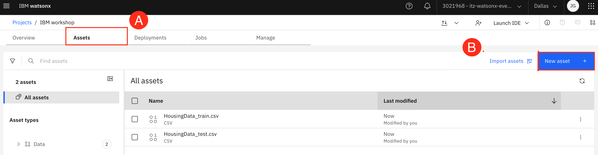

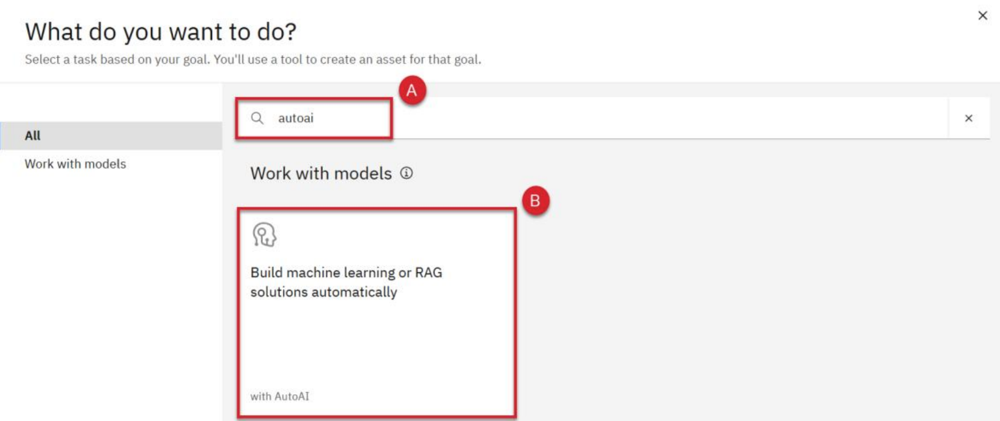

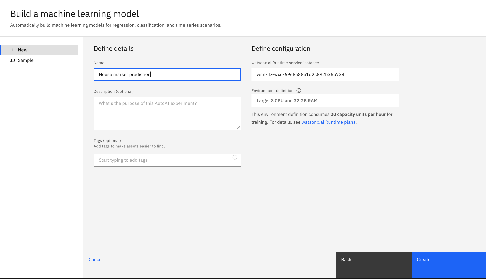

### Step 5: Select Training Data for AutoAI

In the AutoAI experiment setup:
1. Click **Select from project** to choose your uploaded dataset
2. Browse and select your training dataset (e.g., `HousingData_train.csv`)
3. Click **Select** to confirm

The dataset will now be loaded into the AutoAI experiment.

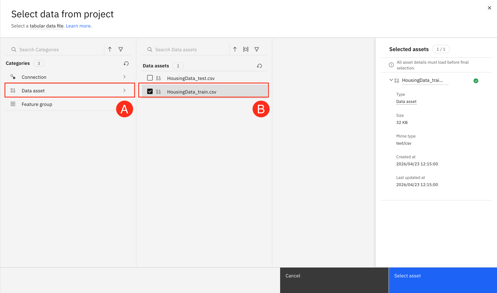

### Step 6: Configure Prediction Column

Configure what you want to predict:
1. **Prediction column**: Select the target variable you want to predict (e.g., "MEDV" for median house value)
2. **Prediction type**: AutoAI will automatically detect if this is a regression or classification problem
   - **Regression**: Predicting continuous values (e.g., house prices, temperatures)
   - **Classification**: Predicting categories (e.g., spam/not spam, disease types)

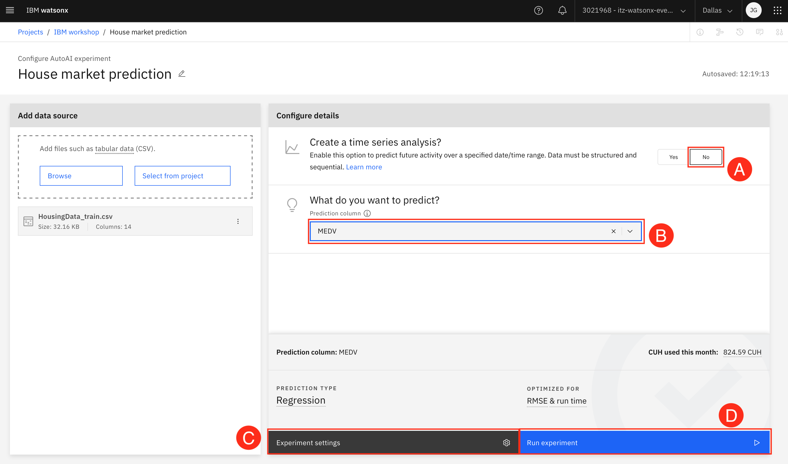

### Step 7: Configure Experiment Settings (Self-Guided)

**🎯 Self-Guided Exercise:**

Now it's time to configure your AutoAI experiment! This is where you make important decisions about how your model will be trained. Take your time to explore the different options and understand their impact.

#### Choose Your Optimization Metric

Select the metric that AutoAI will optimize during model training. This determines what "best" means for your model:

**For Regression Problems** (predicting continuous values like house prices):
- **RMSE (Root Mean Square Error)**: Measures average prediction error. Lower is better. Penalizes large errors more heavily.
- **R² (R-squared)**: Measures how well the model explains variance in data. Higher is better (0 to 1 scale).
- **MAE (Mean Absolute Error)**: Average absolute difference between predictions and actual values. Lower is better. Less sensitive to outliers than RMSE.

**For Classification Problems** (predicting categories):
- **Accuracy**: Percentage of correct predictions. Good for balanced datasets.
- **ROC AUC**: Area under the ROC curve. Good for imbalanced datasets.
- **Precision**: Of all positive predictions, how many were correct? Important when false positives are costly.
- **Recall**: Of all actual positives, how many did we find? Important when false negatives are costly.

**Your Task:**
- For the housing price prediction, which metric makes most sense? Why?
- Consider: Do you care more about average error (MAE) or penalizing large mistakes (RMSE)?

#### Explore Experiment Settings

Click on **Experiment settings** to explore additional configuration options:

**Algorithm Selection:**
- AutoAI can test multiple algorithms: Decision Trees, Random Forest, XGBoost, LightGBM, Linear Regression, etc.
- **Your Task**: Should you test all algorithms or focus on specific ones? Consider training time vs. thoroughness.

**Feature Engineering:**
- AutoAI can automatically create new features from existing ones (e.g., combining features, creating ratios)
- **Options**: None, Basic, Advanced
- **Your Task**: More feature engineering can improve accuracy but increases training time. What level will you choose?

**Hyperparameter Optimization (HPO):**
- Fine-tunes the settings of each algorithm for better performance
- **Options**: None, Basic, Advanced
- **Your Task**: Advanced HPO finds better models but takes longer. Balance quality vs. time.

**Data Split:**
- How to divide data between training and testing
- **Common splits**: 80/20, 70/30, 90/10
- **Your Task**: Larger training sets help the model learn more, but smaller test sets may not reliably measure performance. What's your choice?

**Training Time:**
- Maximum time AutoAI will spend training models
- **Your Task**: Longer training allows more experimentation but requires patience. Set a realistic time limit.

**Holdout Data:**
- Option to set aside additional data for final validation
- **Your Task**: Do you want an extra validation set, or is the test set sufficient?

#### Make Your Choices

Based on your exploration:
1. Select your optimization metric
2. Configure your experiment settings (or use defaults)
3. Review your choices - you can always run another experiment with different settings later
4. Click **Run experiment** when ready

**Reflection Questions:**
- Why did you choose your specific metric?
- What trade-offs did you consider between training time and model quality?
- How might your choices affect the final model's performance?

**Remember:** There's no single "correct" configuration. Different settings work better for different problems. The goal is to understand the options and make informed decisions!

### Step 9: Monitor Training Progress

AutoAI is now training multiple models:
- **Progress bar**: Shows overall completion
- **Pipeline leaderboard**: Displays models as they complete, ranked by performance
- **Status**: Shows which stage of training is currently running (data preprocessing, model training, hyperparameter optimization)

This process may take several minutes depending on your data size and complexity.

### Step 10: Review Model Leaderboard

Once training completes, you'll see the pipeline leaderboard:
- **Rank**: Models sorted by performance (best at top)
- **Pipeline name**: Each pipeline represents a different algorithm and configuration
- **Metric score**: Performance on your chosen metric (e.g., RMSE, R²)
- **Algorithm**: The machine learning algorithm used (e.g., XGBoost, Random Forest)

The top-ranked model (Pipeline 1) is typically the best performer.

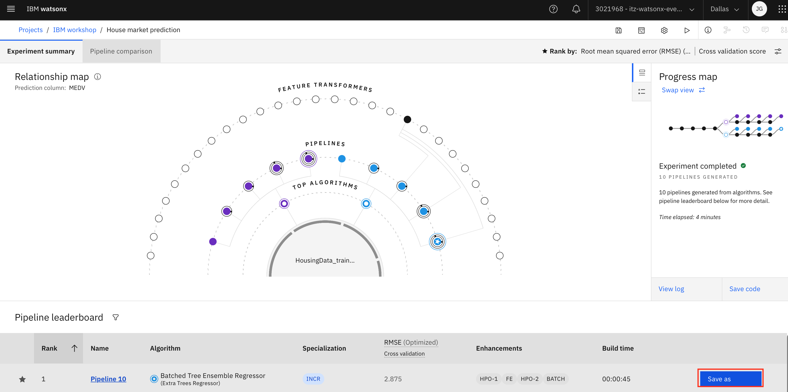

### Step 12: Save Your Best Model

Once you've identified your best model:
1. Click on the pipeline you want to save (usually Pipeline 1)
2. Click **Save as** button
3. Choose **Model** from the options
4. Give your model a descriptive name (e.g., "Housing Price Predictor - XGBoost")
5. Click **Create**

Your model is now saved as an asset in your project.

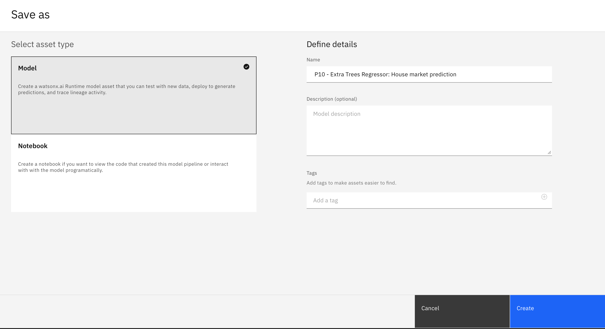

### Step 13: View Saved Model

After saving, you can view your model in the project assets:
- Navigate to the **Assets** tab in your project
- Find your saved model in the **Models** section
- Click on it to view details, including:
  - Model type and algorithm
  - Training metrics
  - Input/output schema
  - Deployment options

---

## Part 3: Deploy Model to Deployment Space

Now that you have a trained model, you need to deploy it to make it accessible via API.

### Step 1: Promote Model to Deployment Space

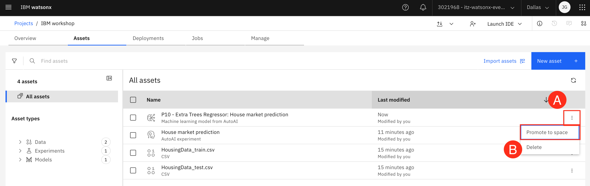

From your saved model page:
1. Click **Promote to deployment space** button
2. Select an existing deployment space or create a new one:
   - **Deployment space name**: Give it a descriptive name (e.g., "Production Models")
   - **Description**: Optional description of the space's purpose
3. Click **Promote**

**What is a deployment space?**
A deployment space is a dedicated environment where you can deploy, manage, and serve your models. It provides:
- API endpoints for model inference
- Version control for deployed models
- Monitoring and logging capabilities
- Access control and governance

### Step 2: Navigate to Deployment Space

After promotion:
1. Click on **View in space** or navigate to **View all deployment spaces** from the left hamburger menu
2. Select your deployment space
3. You'll see your promoted model listed

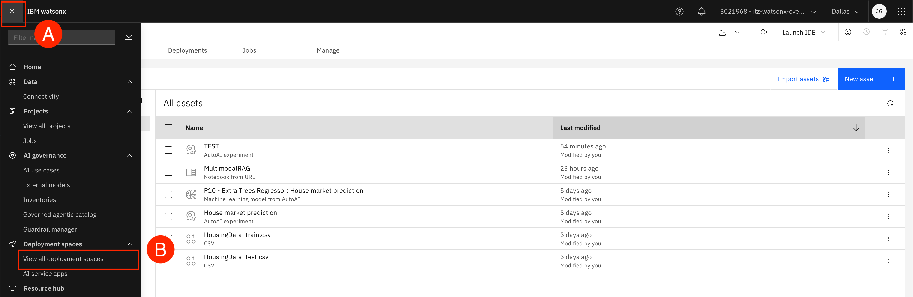

### Step 3: Create Online Deployment

From the deployment space:
1. Click on your model
2. Click **New deployment**
3. Choose **Online** deployment type (for real-time predictions)
4. Configure deployment settings:
   - **Name**: Descriptive deployment name (e.g., "Housing Price API")
   - **Serving name**: Auto-generated API endpoint name
5. Click **Create**

### Step 4: Wait for Deployment

The deployment process takes a few minutes:
- Status will show "Initializing" → "Deploying" → "Deployed"
- Once status shows **Deployed**, your model is ready to receive requests

### Step 5: Get Deployment Details

Once deployed, click on your deployment to view:
- **Deployment ID**: Unique identifier for this deployment
- **API endpoints**: The API URL to send prediction requests
- **API reference**: Documentation on how to call the API
- **Test**: Built-in interface to test predictions

**Important:** Copy and save **Public endpoint** - you'll need it for the notebook:

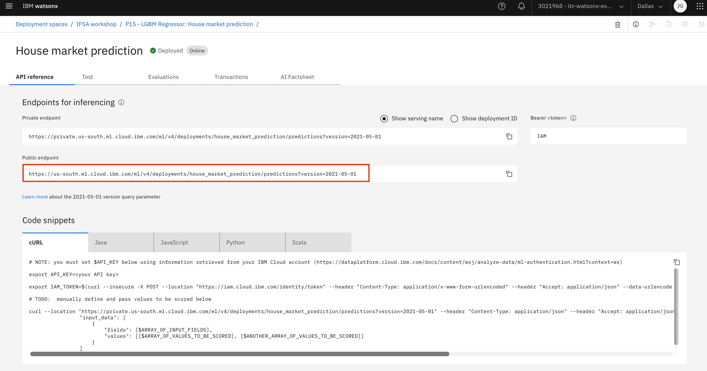

---

## Part 4: Upload Notebook to watsonx.ai Studio Project

Now you'll upload a Jupyter notebook that will call your deployed model.

### Step 1: Return to Your Project

1. Navigate back to your watsonx.ai project (not the deployment space)
2. Click on the **Assets** tab

### Step 2: Add Notebook to Project

1. Click **New asset**
2. Select **Jupyter Notebook** from the asset types
3. Choose **URL** tab
4. Use following Notebook URL: https://github.com/garcejan/IFSA-students/blob/main/AutoAI/src/api_call_prediction.ipynb 
5. Give your notebook a name
6. Select the runtime environment:
   - **Runtime**: Default Python 3.x runtime
   - **Hardware**: Small configuration is sufficient for this exercise
7. Click **Create**

### Step 3: Notebook Opens in Editor

The notebook will open in the Jupyter notebook editor within watsonx.ai Studio. You'll see:
- Code cells with Python code
- Markdown cells with instructions and explanations
- Output cells (empty until you run the code)

---

## Part 5: Run Notebook and Complete Code

The notebook `api_call_prediction.ipynb` contains code to call your deployed model. Some sections require you to fill in your specific details - API key, model endpoint and train dataset loading (labelled with `INSERT CODE BELOW`)

### Understanding the Notebook Structure

The notebook is organized into the following sections:

1. **Setup and Authentication**: Import libraries and authenticate with IBM Cloud
2. **Configuration**: Set your deployment details (API key, deployment space ID, scoring URL)
3. **Helper Functions**: Functions to get authentication tokens and make API calls
4. **Load Test Data**: Load sample data for making predictions
5. **Make Predictions**: Call the deployed model and get results
6. **Analyze Results**: Visualize and interpret the predictions

---

## Summary

Congratulations! You've completed the full machine learning workflow:

✅ **Trained** a model using AutoAI's automated machine learning  
✅ **Deployed** the model to a production-ready deployment space  
✅ **Called** the deployed model via API from a Jupyter notebook  
✅ **Analyzed** prediction results and model performance  

### Key Takeaways

1. **AutoAI** automates the complex process of model training, testing multiple algorithms and configurations
2. **Deployment spaces** provide a managed environment for serving models via API
3. **API-based inference** allows you to integrate ML models into applications and workflows
4. **Model monitoring** helps track performance and detect issues in production

### Next Steps

- Experiment with different datasets and prediction problems
- Try deploying multiple model versions and compare their performance
- Integrate the model API into a web application or data pipeline
- Explore batch deployment for processing large datasets
- Set up model monitoring and retraining workflows

---

## Additional Resources

- [IBM watsonx.ai Documentation](https://www.ibm.com/docs/en/watsonx-as-a-service)
- [AutoAI Documentation](https://www.ibm.com/docs/en/cloud-paks/cp-data/4.8.x?topic=models-autoai)
- [Watson Machine Learning Python SDK](https://ibm.github.io/watson-machine-learning-sdk/)
- [Model Deployment Best Practices](https://www.ibm.com/docs/en/cloud-paks/cp-data/4.8.x?topic=deployments-managing)

---

## Support

If you encounter any issues or have questions:
1. Check the troubleshooting section above
2. Review the IBM watsonx.ai documentation
3. Contact your instructor or teaching assistant
4. Post questions in the course discussion forum
